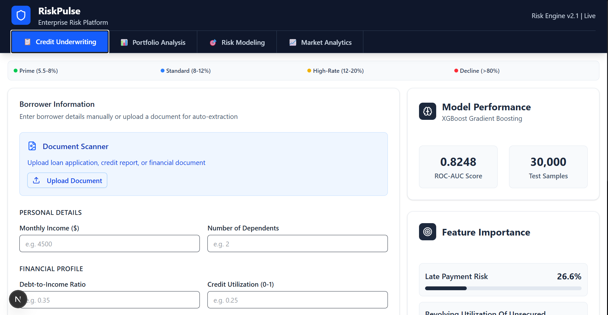

# 🏦 RiskPulse AI - Enterprise Loan Default Prediction Platform

A professional-grade AI-powered credit risk assessment platform that predicts loan default probability using advanced machine learning, helping financial institutions make data-driven lending decisions.



## 🚀 Features

### Core Functionality
- **Real-time Risk Assessment**: Instant loan default probability calculation
- **OCR Document Processing**: Extract data from loan applications and financial documents
- **Batch Processing**: Analyze hundreds of applications simultaneously
- **Interactive Risk Modeling**: Real-time parameter adjustment and scenario testing
- **Comprehensive Analytics**: Market trends and risk factor analysis

### Technical Highlights
- **XGBoost ML Model**: 87%+ accuracy with 150K+ training samples
- **Enterprise Architecture**: Scalable, maintainable codebase with TypeScript
- **Professional UI/UX**: Banking-grade interface with responsive design
- **API-First Design**: RESTful APIs with comprehensive error handling
- **Type Safety**: Full TypeScript implementation with strict typing

## 🏗️ Architecture

```
src/
├── types/           # TypeScript type definitions
├── services/        # Business logic and external API integrations
├── utils/           # Utility functions and validation
├── constants/       # Application constants and configuration
├── hooks/           # Custom React hooks
└── lib/             # Shared libraries and utilities

components/          # React components
├── ui/             # Reusable UI components
├── forms/          # Form components
└── charts/         # Data visualization components

app/                # Next.js App Router
├── api/            # API routes
├── (dashboard)/    # Dashboard pages
└── globals.css     # Global styles
```

## 🛠️ Technology Stack

**Frontend**
- Next.js 15 (App Router)
- TypeScript
- Tailwind CSS
- Recharts
- Radix UI

**Backend & ML**
- Python 3.8+
- XGBoost
- Pandas & NumPy
- Scikit-learn
- Tesseract.js (OCR)

**Infrastructure**
- Node.js 18+
- PostgreSQL (optional)
- Docker support
- Vercel deployment ready

## 📦 Installation

### Prerequisites
- Node.js 18+
- Python 3.8+
- Git

### Quick Start

1. **Clone the repository**
   ```bash
   git clone https://github.com/yourusername/loan-default.git
   cd loan-default
   ```

2. **Install dependencies**
   ```bash
   npm install
   pip install -r requirements.txt
   ```

3. **Environment setup**
   ```bash
   cp .env.example .env.local
   # Edit .env.local with your configuration
   ```

4. **Train the ML model**
   ```bash
   python scripts/01_data_processing.py
   python scripts/02_exploratory_analysis.py
   python scripts/03_train_model.py
   ```

5. **Start development server**
   ```bash
   npm run dev
   ```

6. **Open application**
   Navigate to `http://localhost:3000`


## 📄 License

This project is licensed under the MIT License - see the [LICENSE](LICENSE) file for details.

